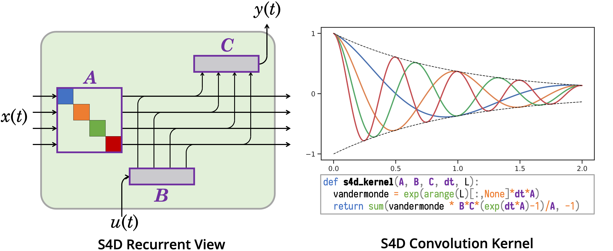
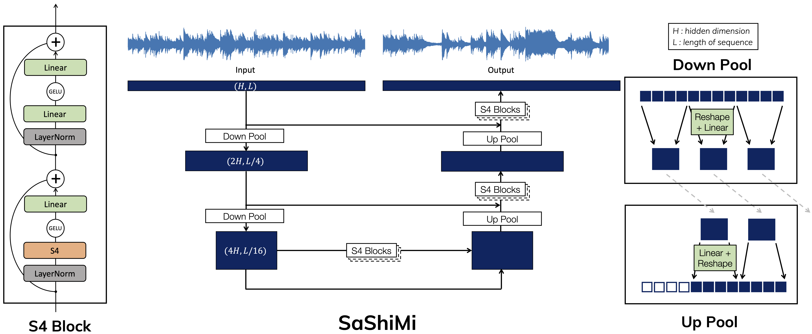
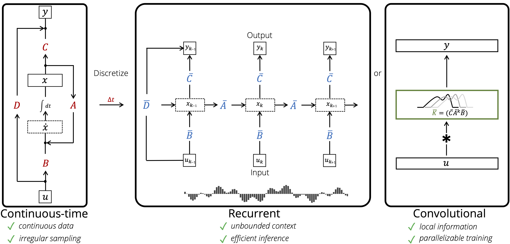

# Structured State Spaces for Sequence Modeling

This repository provides implementations and experiments for the following papers.

## S4D


> **On the Parameterization and Initialization of Diagonal State Space Models**\
> Albert Gu, Ankit Gupta, Karan Goel, Christopher Ré\
> Paper: https://arxiv.org/abs/2206.11893

Other variants including [DSS](https://github.com/ag1988/dss) and [GSS](https://arxiv.org/abs/2206.13947) are also supported. DSS is the predecessor to S4D that is also available in its own [fork](https://github.com/ag1988/dss).

## HTTYH


> **How to Train Your HiPPO: State Spaces with Generalized Orthogonal Basis Projections**\
> Albert Gu*, Isys Johnson*, Aman Timalsina, Atri Rudra, Christopher Ré\
> Paper: https://arxiv.org/abs/2206.12037

## SaShiMi (ICML 2022 - Long Talk)


> **It's Raw! Audio Generation with State-Space Models**\
> Karan Goel, Albert Gu, Chris Donahue, Christopher Ré\
> Paper: https://arxiv.org/abs/2202.09729

## S4 (ICLR 2022 - Outstanding Paper HM)


> **Efficiently Modeling Long Sequences with Structured State Spaces**\
> Albert Gu, Karan Goel, Christopher Ré\
> Paper: https://arxiv.org/abs/2111.00396

## LSSL (NeurIPS 2021)


> **Combining Recurrent, Convolutional, and Continuous-time Models with the Linear State Space Layer**\
> Albert Gu, Isys Johnson, Karan Goel, Khaled Saab, Tri Dao, Atri Rudra, Christopher Ré\
> Paper: https://arxiv.org/abs/2110.13985

## HiPPO (NeurIPS 2020 - Spotlight)

> **HiPPO: Recurrent Memory with Optimal Polynomial Projections**\
> Albert Gu*, Tri Dao*, Stefano Ermon, Atri Rudra, Christopher Ré\
> Paper: https://arxiv.org/abs/2008.07669


## Table of Contents

Setting up the environment and porting S4 to external codebases:
- [Setup](#setup)
- [Getting Started with S4](#getting-started-with-s4)

Reproducing experiments from the papers:
- [Experiments](#experiments)
- [SaShiMi](sashimi/)

Using this repository for training models:
- [Training](#training)
- [Generation](#generation)
- [Repository Structure](#overall-repository-structure)
- [READMEs](#readmes)
- [Citation](#citation)

### Changelog
See [CHANGELOG.md](CHANGELOG.md)

### Roadmap
- More documentation for training from scratch using this repository
- Compilation of S4 resources and implementations
- pip package


## Setup

### Requirements
This repository requires Python 3.8+ and Pytorch 1.10+.
Other packages are listed in [requirements.txt](./requirements.txt).

### Cauchy Kernel

A core operation of S4 is the "Cauchy kernel" described in the [paper](https://arxiv.org/abs/2111.00396).
This is actually a very simple operation; a naive implementation of this operation can be found in the [standalone](src/models/s4/s4.py) in the function `cauchy_naive`.
However, as the paper describes, this has suboptimal memory usage that currently requires a custom kernel to overcome in PyTorch.

Two more efficient methods are supported. The code will automatically detect if either of these is installed and call the appropriate kernel.

#### Custom CUDA Kernel

This version is faster but requires manual compilation for each machine environment.
Run `python setup.py install` from the directory `extensions/cauchy/`.

#### Pykeops

This version is provided by the [pykeops library](https://www.kernel-operations.io/keops/python/installation.html).
Installation usually works out of the box with `pip install pykeops cmake` which are also listed in the requirements file.


## Getting Started with S4

### S4 Module

Self-contained files for the S4 layer and variants can be found in [src/models/s4/](./src/models/s4/),
which includes instructions for calling the module.

See [notebooks/](notebooks/) for visualizations explaining some concepts behind HiPPO and S4.

### Example Train Script (External Usage)

[example.py](example.py) is a self-contained training script for MNIST and CIFAR that imports the standalone S4 file. The default settings `python example.py` reaches 88% accuracy on sequential CIFAR with a very simple S4D model of 200k parameters.
This script can be used as an example for using S4 in external repositories.

### Training with this Repository (Internal Usage)

This repository aims to provide a very flexible framework for training sequence models. Many models and datasets are supported.

Basic usage is `python -m train`, or equivalently
```
python -m train pipeline=mnist model=s4
```
which trains an S4 model on the Permuted MNIST dataset.
This should get to around 90% after 1 epoch which takes 1-3 minutes depending on GPU.

More examples of using this repository can be found in [Experiments](#experiments) and [Training](#training).

### Optimizer Hyperparameters

One important feature of this codebase is supporting parameters that require different optimizer hyperparameters.
In particular, the SSM kernel is particularly sensitive to the $(A, B)$ (and sometimes $\Delta$ parameters),
so the learning rate on these parameters is sometimes lowered and the weight decay is always set to $0$.

See the method `register` in the model (e.g. [s4d.py](src/models/s4/s4d.py)) and the function `setup_optimizer` in the training script (e.g. [example.py](example.py)) for an examples of how to implement this in external repos.

<!--
Our logic for setting these parameters can be found in the `OptimModule` class under `src/models/sequence/ss/kernel.py` and the corresponding optimizer hook in `SequenceLightningModule.configure_optimizers` under `train.py`
-->

## Experiments

Instructions for reproducing experiments from the papers can be found in [experiments.md](experiments.md).


### Data

Basic datasets are auto-downloaded, including MNIST, CIFAR, and Speech Commands.
All logic for creating and loading datasets is in [src/dataloaders](./src/dataloaders/) directory.
The README inside this subdirectory documents how to download and organize other datasets.

### Models

Models are defined in [src/models](src/models). See the README in this subdirectory for an overview.


## Training

The core training infrastructure of this repository is based on [Pytorch-Lightning](https://pytorch-lightning.readthedocs.io/en/latest/) with a configuration scheme based on [Hydra](https://hydra.cc/docs/intro/).

The main entrypoint is `train.py` and configs are found in `configs/`.

### Configs and Hyperparameters
Pre-defined configs for many end-to-end experiments are provided (see [experiments.md](experiments.md)).

Configs can also be easily modified through the command line.
An example experiment is
```
python -m train pipeline=mnist dataset.permute=True model=s4 model.n_layers=3 model.d_model=128 model.norm=batch model.prenorm=True wandb=null
```
This uses the Permuted MNIST task with an S4 model with a specified number of layers, backbone dimension, and normalization type.

See [configs/README.md](configs/) for more detailed documentation about the configs.

#### Hydra

It is recommended to read the [Hydra documentation](https://hydra.cc/docs/intro/) to fully understand the configuration framework. For help launching specific experiments, please file an issue.

<!--
#### Registries

This codebase uses a modification of the hydra `instantiate` utility that provides shorthand names of different classes, for convenience in configuration and logging.
The mapping from shorthand to full path can be found in `src/utils/registry.py`.
-->


### Resuming

Each experiment will be logged to its own directory (generated by Hydra) of the form `./outputs/<date>/<time>/`. Checkpoints will be saved here inside this folder and printed to console whenever a new checkpoint is created.
To resume training, simply point to the desired `.ckpt` file (a PyTorch Lightning checkpoint, e.g. `./outputs/<date>/<time>/checkpoints/val/loss.ckpt`) and append the flag `train.ckpt=<path>/<to>/<checkpoint>.ckpt` to the original training command.

### PyTorch Lightning Trainer

The PTL [Trainer](https://pytorch-lightning.readthedocs.io/en/stable/common/trainer.html) class controls the overall training loop and also provides many useful pre-defined flags. Some useful examples are explained below.
The full list of allowable flags can be found in the PTL documentation, as well as our [trainer configs](configs/trainer/). See the default trainer config [configs/trainer/default.yaml](configs/trainer/default.yaml) for the most useful options.

#### Multi-GPU training

Simply pass in `trainer.gpus=2` to train with 2 GPUs.

#### Inspect model layers

`trainer.weights_summary=full` prints out every layer of the model with their parameter counts. Useful for debugging internals of models.

#### Data subsampling
`trainer.limit_{train,val}_batches={10,0.1}` trains (validates) on only 10 batches (0.1 fraction of all batches). Useful for testing the train loop without going through all the data.


### WandB

Logging with [WandB](https://wandb.ai/site) is built into this repository.
In order to use this, simply set your `WANDB_API_KEY` environment variable, and change the `wandb.project` attribute of [configs/config.yaml](configs/config.yaml) (or pass it on the command line e.g. `python -m train .... wandb.project=s4`).

Set `wandb=null` to turn off WandB logging.


## Generation

Autoregressive generation can be performed with the [generate.py](generate.py) script.
This script can be used in two ways after training a model using this codebase.

### Option 1: Checkpoint Path
The more flexible option requires the checkpoint path of the trained PyTorch Lightning model.
The generation script accepts the same config options as the train script, with a few additional flags that are documented in [configs/generate.yaml](configs/generate.yaml).
After training with `python -m train <train flags>`, generate with
```
python -m generate <train flags> checkpoint_path=<path/to/model.ckpt> <generation flags>
```
Any of the flags found in the config can be overridden.

Note: This option can be used with either `.ckpt` checkpoints (PyTorch Lightning, which includes information for the Trainer) or `.pt` checkpoints (PyTorch, which is just a model state dict).

### Option 2: Experiment Path
The second option for generation does not require passing in training flags again, and instead reads the config from the Hydra experiment folder, along with a PyTorch Lightning checkpoint within the experiment folder.

### Example 1 (Language)

Download the [WikiText-103 model checkpoint](https://huggingface.co/krandiash/sashimi-release/tree/main/checkpoints), for example to `./checkpoints/s4-wt103.pt`.
This model was trained with the command `python -m train experiment=lm/s4-wt103`. Note that from the config we can see that the model was trained with a receptive field of length 8192.

To generate, run
```
python -m generate experiment=lm/s4-wt103 checkpoint_path=checkpoints/s4-wt103.pt n_samples=1 l_sample=16384 l_prefix=8192 decode=text
```
This generates a sample of length 16384 conditioned on a prefix of length 8192.

### Example 2 (Audio)

Let's train a small SaShiMi model on the SC09 dataset. We can also reduce the number of training and validation batches to get a checkpoint faster:
```
python -m train experiment=audio/sashimi-sc09 model.n_layers=2 trainer.limit_train_batches=0.1 trainer.limit_val_batches=0.1
```

After the first epoch completes, a message is printed indicating where the checkpoint is saved.
```
Epoch 0, global step 96: val/loss reached 3.71754 (best 3.71754), saving model to "<repository>/outputs/<date>/<time>/checkpoints/val/loss.ckpt"
```

Option 1:
```
python -m generate experiment=audio/sashimi-sc09 model.n_layers=2 checkpoint_path=<repository>/outputs/<date>/<time>/checkpoints/val/loss.ckpt n_samples=4 l_sample=16000
```
This option redefines the full config so that the model and dataset can be constructed.

Option 2:
```
python -m generate experiment_path=<repository>/outputs/<date>/<time> checkpoint_path=checkpoints/val/loss.ckpt n_samples=4 l_sample=16000
```
This option only needs the path to the Hydra experiment folder and the desired checkpoint within.


## Overall Repository Structure
```
configs/         config files for model, data pipeline, training loop, etc.
data/            default location of raw data
extensions/      CUDA extension for Cauchy kernel
src/             main source code for models, datasets, etc.
  callbacks/     training loop utilities (e.g. checkpointing)
  dataloaders/   dataset and dataloader definitions
  models/        model definitions
  tasks/         encoder/decoder modules to interface between data and model backbone
  utils/
sashimi/         SaShiMi README and additional code (generation, metrics, MTurk)
example.py       Example training script for using S4 externally
train.py         Training entrypoint for this repo
generate.py      Autoregressive generation script
```

## READMEs
In addition to this top level README, several READMEs detailing the usage of this repository are organized in subdirectories.

- [src/dataloaders/README.md](src/dataloaders/)
- [src/models/README.md](src/models/)
- [src/models/s4/README.md](src/models/s4/)
- [experiments.md](experiments.md)
- [configs/README.md](configs/)
- [configs/model/README.md](configs/model/)
- [configs/experiment/README.md](configs/experiment/)
- [sashimi/README.md](sashimi/)


## Citation
If you use this codebase, or otherwise found our work valuable, please cite:
```
@article{gu2022s4d,
  title={On the Parameterization and Initialization of Diagonal State Space Models},
  author={Gu, Albert and Gupta, Ankit and Goel, Karan and R\'e, Christopher},
  journal={arXiv preprint arXiv:2206.11893},
  year={2022}
}

@article{gu2022hippo,
  title={How to Train Your HiPPO: State Space Models with Generalized Basis Projections},
  author={Gu, Albert and Johnson, Isys and Timalsina, Aman and Rudra, Atri and R\'e, Christopher},
  journal={arXiv preprint arXiv:2206.12037},
  year={2022}
}

@article{goel2022sashimi,
  title={It's Raw! Audio Generation with State-Space Models},
  author={Goel, Karan and Gu, Albert and Donahue, Chris and R{\'e}, Christopher},
  journal={International Conference on Machine Learning ({ICML})},
  year={2022}
}

@inproceedings{gu2022efficiently,
  title={Efficiently Modeling Long Sequences with Structured State Spaces},
  author={Gu, Albert and Goel, Karan and R\'e, Christopher},
  booktitle={The International Conference on Learning Representations ({ICLR})},
  year={2022}
}

@article{gu2021combining,
  title={Combining Recurrent, Convolutional, and Continuous-time Models with Linear State-Space Layers},
  author={Gu, Albert and Johnson, Isys and Goel, Karan and Saab, Khaled and Dao, Tri and Rudra, Atri and R{\'e}, Christopher},
  journal={Advances in neural information processing systems},
  volume={34},
  year={2021}
}

@article{gu2020hippo,
  title={HiPPO: Recurrent Memory with Optimal Polynomial Projections},
  author={Gu, Albert and Dao, Tri and Ermon, Stefano and Rudra, Atri and R{\'e}, Christopher},
  journal={Advances in neural information processing systems},
  volume={33},
  year={2020}
}
```
